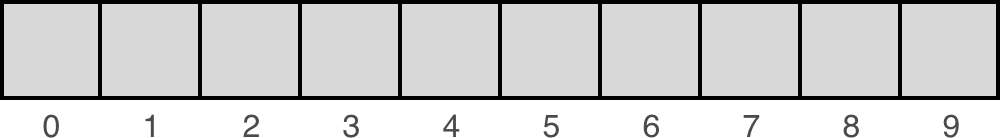

# Why data structures?

_Data structures_  are containers that organize and group data together in different ways. When you write code to solve a problem, there will always be data involved—and how you store or structure that data in the computer's memory can have a huge impact on what kinds of things you can do with it and how efficiently you can do those things.

In this section, we'll start out by reviewing some basic data structures that you're probably at least partly familiar with already.

Then, as we go on in the course, we'll consider the pros and cons of using different structures when solving different types of problems.

We'll start with a discussion of a very general structure—a  **collection**.

Collection is just a group of things. Collections don't have a particular order. So, we can't say "give me the third element in the collection", since there's no inherent order. 

Collections also don't need to have the same type of object. 

A collection on its own isn't something you can use in a programming language. However, there are many data structures that are extensions of collections. They just add more rules to the ones that already apply for collections.   

## Properties of collections

As Brynn discussed, collections:

-   Don't have a particular order (so you can't say "give me the 3rd element in this collection")
-   Don't have to have objects of the same type

# Lists
A list has all the properties of a collection. So, it has a group of things but _**the objects have an order**_. The order really doesn't mean much and there's no fixed length. You can add or remove objects from a list. 

What exactly the implementation looks like for adding/removing elements will change based on the language and the type of data structure. 

In this course, we'll learn about different types of list. Different programming languages treat them differently. Sometimes a list is incorporated as a core feature of a programming language, but what that looks like can vary widely. Here, we're focused on the theoretical concepts that could apply to any language. 

## Properties of lists

As Brynn described, lists:

-   Have an  **order**  (so you can say things like "give me the 3rd item in the list")
-   Have  **no fixed length**  (you can add or remove elements)

# Arrays
Arrays are perhaps the most common implementations of lists. In many programming languages, the ability to create an array is built in as a core feature. 

An array is a list with few added rules (so, we already know it has order). In some languages you can only have objects with the same types in the same array, and in some languages your array can contain different types. So, we can't use that as a rule to define arrays. 

It'd also be nice to say that arrays have a set size that you determine right when you create them. Again, this is only true in some programming languages, so we need to avoid adding that to our definition. 

Defining the thing that different languages call arrays is actually pretty hard. 

There's one big feature that differentiates arrays from lists. **Each array has a location called an _index_**. An **index** is just the number associated with that place in the array. 

It'd make sense to number indices from one, but **normally an index starts at zero**. 

Having indices can make using arrays a great or sometimes a terrible choice for the code you're working on. If you need to access a certain location in the middle frequently, using an array can be great choice. You just need to keep track of how long the array is, calculate the middle element, and get the object in that index. 

**Insertion and deletion can be really messy with arrays**. **Inserting in the end is often easy** but it can be hard if the array has a set size and you've already filled it up. 

**Insertion is difficult if you want to put an element in the middle of an array**. If you want to do a normal insert, you'll need to move everything after the inserted element back into different indices. The operation as a whole is pretty inefficient since you need to move every element behind the one you're inserting back in the array. In the worst case, this operation takes linear time or `O(n)`. 

**Deletion causes a same problem**. If you delete an element, you have an empty index. 

Again, all of these can change based on the way a particular language implements an array but it's important to consider we're talking about arrays abstractly. 

## Arrays vs. lists vs. Python lists

The distinction between arrays and lists can be a little confusing, especially because of how Python implements the data structure it calls a "list". Below, we'll go over some key points that should make this clearer.

### Arrays

An array has some things in common with a list. In both cases:

-   There is a collection of items
-   The items have an order to them

But as Brynn discussed in the video, one of the key differences is that  _arrays have indexes, while lists do not_.

To understand this, it helps to know how arrays are stored in memory. When an array is created, it is always given some initial size—that is, the number of elements it should be able to hold (and how large each element is). The computer then finds a block of memory and sets aside the space for the array.

Importantly, the space that gets set aside is one, continuous block. That is, all of the elements of the array are  _contiguous_, meaning that they are all next to one another in memory.

Another key characteristic of an array is that all of the elements are the same size.

When we represent an array visually, we often draw it as a series of boxes that are all of the same size and all right next to one another:

<p align="center">

</p>

Because all of the elements are 1) next to one another and 2) the same size, this means that if we know the location of the first element, we can calculate the location of any other element.

For example, if the first element in the array is at memory location  `00`  and the elements are 24 bytes, then the next element would be at location 00 + 24 =  `24`. And the one after that would be at 24 + 24 =  `48`, and so on.

Since we can easily calculate the location of any item in the array, we can assign each item an index and use that index to quickly and directly access the item.

<p align="center">

</p>

### Lists

In contrast, the elements of a list may or may not be next to one another in memory! For example, later in this lesson we'll look at  _linked lists_, where each list item points to the next list item—but where the items themselves may be scattered in different locations of memory. In this case, knowing the location of the first item in the list does not mean you can simply calculate the location of the other items. This means we cannot use indexes to directly access the list items as we would in an array. We'll explore linked lists in more detail shortly.

## Python lists

In Python, we can create a list using square brackets  `[ ]`. For example:

```python
>>> my_list = ['a', 'b', 'c']
>>> my_list
['a', 'b', 'c']
```

And then we can access an item in the list by providing an index for that item:

```python
>>> my_list[0]
'a'
>>> my_list[1]
'b'
>>> my_list[2]
'c'
```

But wait, didn't we just say that lists  _don't_  have indexes!? This seems to directly contradict that distinction.

The reason for this confusion is simply one of terminology. The earlier description we gave of lists is correct  _in general_—that is, usually when you hear someone refer to something as a "list", that is what they mean. However, in Python the term is used differently.

We will not get into all of the details, but the important thing you need to know for this course is the following: If you were to look under the hood, you would find that  **a Python list is essentially implemented like an array**  (specifically, it behaves like a  _dynamic array_, if you're curious). In particular,  **the elements of a Python list are contiguous in memory, and they can be accessed using an index.**

In addition to the underlying array, a Python list also includes some additional behavior. For example, you can use things like  `pop`  and  `append`  methods on a Python list to add or remove items. Using those methods, you can essentially utilize a Python list like a stack (which is another type of data structure we'll discuss shortly).

In general, we will try to avoid using things like  `pop`  and  `append`, because these are high-level language features that may not be available to you in other languages. In most cases, we will ignore the extra functionality that comes with Python lists, and instead use them  **as if they were simple arrays**. This will allow you to see how the underlying data structures work, regardless of the language you are using to implement those structures.

Here's the bottom line:

-   Python lists are essentially arrays, but also include additional high-level functionality
-   During this course, we will generally ignore this high-level functionality and treat Python lists as if they were simple arrays

This approach will allow you to develop a better understanding for the underlying data structures.

# Strings
Strings in Python are arrays of bytes representing unicode characters.

**Anagrams:** An anagram is a word (or phrase) that is formed by rearranging the letters of another word (or phrase).

**Hamming Distance:** In information theory, the Hamming distance between two strings of equal length is the number of positions at which the corresponding symbols are different.

Checkout [this notebook](Strings.ipynb) for some practice on the above concepts.

# Linked Lists: Introduction
Let's look at arrays in another way. You can think of an array as a set of boxes where each has an _address_ called an **index**. In a similar sense, a chain is like a construct called a **linked list**. 

A **linked list** is an extension of a list, but it's definitely not an array. **There are still some things that have order, but there are no indices**. Instead, a linked list is characterized by its **links**. Each element has some notion of what the next element is since it's connected to it, but not necessarily how long the list is or where it is in the list. 

An arrya is different. There is nothing in one element of the array that says here's your next element. You know what the next element is by what the next index is. 

Now, **why whould anybody want to use a linked list?** Anyhow, an array gives you more information since you already know where is next element falls in the array. However, adding and removing elements from an array can be really complicated. 

**Adding and removing elements from a linked list turns out to be so easy by comparison**. You can actually take an element out or add one in. There's only one real quick consideration here which we'll cover in the following sections.

# Linked List
In higher level programming languages _there often isn't a distinction between linked lists and arrays_. There's just a list that has the properties of both. 

However, questions about these two data structures are fairly common in interviews, so it's important to know the difference. 

Again, the main distinction is that each element stores different information. 

In both cases, a single element will store a value (or the actual information). We also one othe type of information. In an array we would store a number as an index. You can get the next element by querying the array for the element at the next index (i.e. current_index + 1). 

In a linked list, we store a reference to the next element in the list. In many languages, this will look like assigning the actual next element as a property of this element. Way down at the hardware level your element actually has some space dedicated for it in memory. So, basically the current element will also store the _**memory address**_ of the next element. 

The next thing about the linked list is that **it's pretty easy to insert delete elements**. 

Adding an element is going to be changing the next reference to point to the new object. That's it. 

**NOTE:** There's a quick trick you need to remember though. If you delete the next reference and replace it with a new object, you'll lost your reference to this object. You should always assign your next pointer for the current element before you assign your next pointer for the previous element so you don't lose reference.

**NOTE:** Note that insertion takes constant time in this case since you're just shifting around pointers and not iterating over every element in the list.

**Removing an element** is going to look pretty similar.

There's also something called **doubly linked list**, where you have pointers to the next element and the previous element. 

See the video [here](https://youtu.be/ZONGA5wmREI).

# Implement a Linked List
We can interpret linked lists as nodes that contains two values: the node value and the address to the next node. To implement it in Python, we can do something like this:

```python
class Node:
    def __init__(self, value):
        self.value = value
        self.next = None

head = Node(2)
head.next = Node(1)

print(head.value)
print(head.next.value)
```

**Traversing a linked list**

Here is an implementation of how to access the elements:

```python
def print_linked_list(head):
    current_node = head
    
    while current_node is not None:
        print(current_node.value)
        current_node = current_node.next
        
print_linked_list(head)
```

## Creating a linked list using iteration
Previously, we created a linked list using a very manual and tedious method. We called `next` multiple times on our `head` node.

Now that we know about iterating over or traversing the linked list, is there a way we can use that to create a linked list?

```python
def create_linked_list(input_list):
    head = None
    for value in input_list:
        if head is None:
            head = Node(value)    
        else:
        # Move to the tail (the last node)
            current_node = head
            while current_node.next:
                current_node = current_node.next
        
            current_node.next = Node(value)
    return head
```

## A more efficient solution
The above solution works, but it has some shortcomings. In this section, we'll demonstrate a different approach and see how its efficiency compares to the solution above.

```python
def create_linked_list_better(input_list):
    
    head = None
    tail = None
    
    for value in input_list:
        
        if head is None:
            head = Node(value)
            tail = head # when we only have 1 node, head and tail refer to the same node
        else:
            tail.next = Node(value) # attach the new node to the `next` of tail
            tail = tail.next # update the tail
            
    return head
```

## Test your code 
Test the codes above using the code below:

```python
### Test Code
def test_function(input_list, head):
    try:
        if len(input_list) == 0:
            if head is not None:
                print("Fail")
                return
        for value in input_list:
            if head.value != value:
                print("Fail")
                return
            else:
                head = head.next
        print("Pass")
    except Exception as e:
        print("Fail: "  + e)
        
        

input_list = [1, 2, 3, 4, 5, 6]
head = create_linked_list_better(input_list)
test_function(input_list, head)

input_list = [1]
head = create_linked_list_better(input_list)
test_function(input_list, head)

input_list = []
head = create_linked_list_better(input_list)
test_function(input_list, head)
```

Refer to [this notebook](linkedlist.ipynb) for practice codes.

## Types of linked lists
For contents on this, refer to [this notebook](linkedlists-types.ipynb).

For more practice on linked list, refer to [this notebook](linkedlist-practice.ipynb).

## Reverse a linked list 
Refer to [this notebook](linkedlist-reverse.ipynb).

## Loop detection in linked list 
Refer to [this notebook](linkedlist-loop.ipynb).

## Flatten a linked list 
Refere to [this notebook](linkedlist-flatten.ipynb).

## Problem: Add One
Refere to [this notebook](linkedlist-addone.ipynb).

## Problem: Duplicate number
Refer to [this notebook](linkedlist-duplicate.ipynb).

## Problem: Max Sum Subarray
Refere to [this notebook](linkedlist-fmaxsum.ipynb).

## Problem: Pascal's Triangle
Refer to [this notebook](linkedlist-pascal.ipynb).

## Problem: Even after odd 
Refer to [this notebook](linkedlist-evenodd.ipynb).

## Problem: Skip i, Delete j
Refer to [this notebook](linkedlist-skip.ipynb).

## Problem: Swap Nodes
Refer to [this notebook](linkedlist-swap.ipynb).


