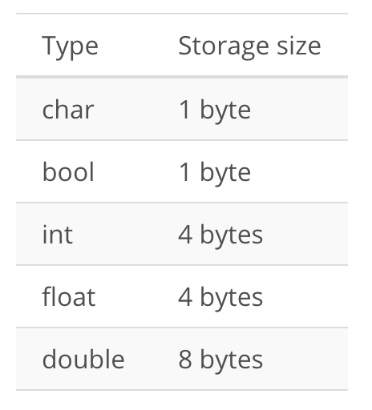

# Efficiency

We said earlier that this Nanodegree program is about how to write code to  **solve problems**  and to do so  **efficiently**.

In the last section, we looked at some basic aspects of solving problems—but we didn't really think too much about whether our solutions were  _efficient_.

## **Space**  and  **time**

When we refer to the  _efficiency_  of a program, we aren't just thinking about its speed—we're considering both the  **time**  it will take to run the program  _and_  the amount of  **space**  the program will require in the computer's memory. Often there will be a trade-off between the two, where you can design a program that runs faster by selecting a data structure that takes up more space—or vice versa.

Efficiency is perhaps the most important concept in this course. Efficiency, also called _**complexity**_, is how well you're using your computer's resources to get a particular job done. You can normally think about it in terms of **space** and **time**. _How long does your code take to run?_ and _how much storage space do you need?_. 

Let's think about efficiency in terms of cutting hair. Normally, your hair would be snipped off in clumps and you would just compare some strands you cut to a group you're about to cut to approximate where your next cut goes. However, you could cut one strand of hair at a time and compare each strand to a ruler or measuring tape to make sure the exact same amount gets cut every single time. That's rediculous though. It'd take a crazy amount of time and it really doesn't matter if hair is exactly and precisely cut. 

Often the tradeoffs for algorithm efficiency are similar. You could take a slow methodical approach, but there's often a faster method that accomplishes the same goal by reducing repitition. 

Efficiency can rely heavily on your creativity and your ability to get the most done with minimal resources, but there are a lot of known tips tricks that you'll expected to know in a technical interview. 

An interviewer will expect you to know some common data structures the efficiency of doing basic things with them as well as some knowledge of specific well-known algorithms. An algorithm is just a series of steps for solving a problem. 

Writing really efficient code can come off with another tradeoff between **time efficiency** and **space efficiency**. _What if your code could run just in a fraction of the time by storing temporary values in a new data structure?_ For that decision you'd need to weigh whether the time of the person using your code or the amount of memory needed is more important. (see the video [here](https://youtu.be/I-RASDPbDrI)).

## Algorithms

> An  **algorithm**  is essentially  _a series of steps for solving a problem_. Usually, an algorithm takes some kind of input (such as an unsorted list) and then produces the desired output (such as a sorted list).

For any given problem, there are usually many different algorithms that will get you to exactly the same end result. But some will be much more efficient than others. To be an effective problem solver, you'll need to develop the ability to look at a problem and identify different algorithms that could be used—and then contrast those algorithms to consider which will be more or less efficient.

## But computers are so fast!

Sometimes it seems like computers run programs so quickly that efficiency shouldn't really matter. And in some cases, this is true—one version of a program may take 10 times longer than another, but they both still run so quickly that it has no real impact.

But in other cases, a small difference in how your code is written—or a tiny change in the type of data structure you use—can mean the difference between a program that runs in a fraction of a millisecond and a program that takes hours (or even  _years_!) to run.

# Quantifying Efficiency
It's fine to say "this algorithm is more efficient than that algorithm", but can we be more specific than that? Can we quantify things and say  _how much_  more efficient the algorithm is?

Let's look at a simple example, so that we have something specific to consider.

Here is a short (and rather silly) function written in Python:

```python
def some_function(n):
    for i in range(2):
        n += 100
    return n
```

What does it do? Adds 200 to a given input. 

Now how about this one?

```python
def other_function(n):
    for i in range(100):
        n += 2
    return n
```

What does it do? Same as above.

So these functions have exactly the same end result. But can you guess which one is more efficient?

Here they are next to each other for comparison:

```python
def some_function(n):
    for i in range(2):
        n += 100
    return n

def other_function(n):
    for i in range(100):
        n += 2
    return n
```

Although the two functions have the exact same end result, one of them iterates many times to get to that result, while the other iterates only a couple of times.

This was admittedly a rather impractical example (you could skip the  `for`  loop altogether and just add  `200`  to the input), but it nevertheless demonstrates one way in which efficiency can come up.

## Counting lines

With the above examples, what we basically did was count the number of lines of code that were executed. Let's look again at the first function:

```python
def some_function(n):
    for i in range(2):
        n += 100
    return n
```

There are four lines in total, but the line inside the  `for`  loop will get run twice. So running this code will involve running  _5 lines_.

Now let's look at the second example:

```python
def other_function(n):
    for i in range(100):
        n += 2
    return n
```

In this case, the code inside the loop runs 100 times. So running this code will involve running  _103 lines_!

Counting lines of code is  _not_  a perfect way to quantify efficiency, and we'll see that there's a lot more to it as we go through the program. But in this case, it's an easy way for us to approximate the difference in efficiency between the two solutions. We can see that if Python has to perform an addition operation 100 times, this will certainly take longer than if it only has to perform an addition operation twice!

# Input size and efficiency
Here's one of our functions from the last page:

```python
def some_function(n):
    for i in range(2):
        n += 100
    return n
```

Suppose we call this function and give it the value  `1`, like this:

```python
some_function(1)
```

And then we call it again, but give it the input  `1000`:

```python
some_function(1000)
```

Will this change the number of lines of code that get run? No, the same number of lines will be run in both cases.

Now, here's a new function:

```python
def say_hello(n):
    for i in range(n):
        print("Hello!")
```

Suppose we call it like this:

```python
say_hello(3)
```

And then we call it like this:

```python
say_hello(1000)
```

Will this change the number of lines of code that get run? Yes, `say_hello(1000)` will involve running more lines of code.

This highlights a key idea:

> As the input to an algorithm increases, the time required to run the algorithm may also increase.

Notice that we said  _may_  increase. As we saw with the above examples, input size sometimes affects the run-time of the program and sometimes doesn't—it depends on the program.

## The rate of increase
Let's look again at this function from above:

```python
def say_hello(n):
    for i in range(n):
        print("Hello!")
```

When we increase the size of the input `n` by 1, how many more lines of code get run? The number of lines also goes up by 1.

So here's one thing that we know about this function: As the input increases, the number of lines executed also increases.

But we can go further than that! We can also say that  _as the input increases, the number of lines executed increases by a proportional amount_. Increasing the input by 1 will cause 1 more line to get run. Increasing the input by 10 will cause 10 more lines to get run. Any change in the input is tied to a consistent, proportional change in the number of lines executed. This type of relationship is called a  **linear relationship**, and we can see why if we graph it:

<p align="center">

</p>

The horizontal axis,  _n_, represents the size of the input (in this case, the number of times we want to print  `"Hello!"`).

The vertical axis,  _N_, represents the number of operations that will be performed. In this case, we're thinking of an "operation" as a single line of Python code (which is not the most accurate, but it will do for now).

We can see that if we give the function a larger input, this will result in more operations. And we can see the  _rate_  at which this increase happens—the rate of increase is  _linear_. Another way of saying this is that the number of operations increases at a constant rate.

If that doesn't quite seem clear yet, it may help to contrast it with an alternative possibility—a function where the operations increase at a rate that is  _not_  constant.

Now here's a slightly modified version of the  `say_hello`  function:

```python
def say_hello(n):
    for i in range(n):
        for i in range(n):
            print("Hello!")
```

Notice that it has a  _nested_  loop (a  `for`  loop inside another  `for`  loop!).

Notice that when the input goes up by a certain amount, the number of operations goes up by the square of that amount. If the input is  2, the number of operations is  `2^2`  or  4. If the input is  3, the number of operations is  `3^2`  or  9.

To state this in general terms, if we have an input,  `n`, then the number of operations will be  `n^2`. This is what we would call a  **quadratic**  rate of increase.

Let's compare that with the  **linear**  rate of increase. In that case, when the input is  `n`, the number of operations is also  `n`.

Let's graph both of these rates so we can see them together:

<p align="center">

</p>


Our code with the nested  `for`  loop exhibits the quadratic  `n^2`  relationship on the left. Notice that this results in a  _much_  faster rate of increase. As we ask our code to print larger and larger numbers of  `"Hellos!"`, the number of operations the computer has to perform shoots up very quickly—much more quickly than our other function, which shows a linear increase.

This brings us to a second key point. We can add it to what we said earlier:

> As the input to an algorithm increases, the time required to run the algorithm may also increase—**and different algorithms may increase at different  _rates_**.

Notice that if  `n`  is very small, it doesn't really matter which function we use—but as we put in larger values for  `n`, the function with the nested loop will quickly become far less efficient.

We've looked here only at a couple of different rates—linear and quadratic. But there are many other possibilities. Here we'll show some of the common types of rates that come up when designing algorithms:

<p align="center">

</p>

We'll look at some of these other  _orders_  as we go through the class. But for now, notice how dramatic a difference there is here between them! Hopefully you can now see that this idea of the  _order_  or  _rate of increase_  in the run-time of an algorithm is an essential concept when designing algorithms.

## Order

We should note that when people refer to the  _rate of increase_  of an algorithm, they will sometimes instead use the term  _order_. Or to put that another way:

> The  _rate of increase_  of an algorithm is also referred to as the  **order**  of the algorithm.

For example, instead of saying "this relationship has a linear rate of increase", we could instead say, "the  _order_  of this relationship is linear".

On the next page, we'll introduce something called  _Big O Notation_, and you'll see that the "O" in the name refers to the  **o**rder of the rate of increase.

# Big O Notation

When describing the efficiency of an algorithm, we could say something like "the run-time of the algorithm increases linearly with the input size". This can get wordy and it also lacks precision. So as an alternative, mathematicians developed a form of notation called  **big O notation**.

The "O" in the name refers to the  _order_  of the function or algorithm in question. And that makes sense, because big O notation is used to describe the order—or rate of increase—in the run-time of an algorithm, in terms of the input size (`n`).

In this next video, Brynn will show some different examples of what the notation would actually look like in practice. This likely won't "click" for you right away, but don't worry—once you've gotten some experience applying it to real problems, it will be much more concrete. See the video [here](https://youtu.be/QF4hPt1WHog).

# Big O Notation (2/2)

In the examples we've looked at here, we've been approximating efficiency by counting the number of lines of code that get executed. But when we are thinking about the run-time of a program, what we really care about is how fast the computer's processor is, and how many operations we're asking the processor to perform. Different lines of code may demand very different numbers of operations from the computer's processor. For now, counting lines will work OK as an approximation, but as we go through the course you'll see that there's a lot more going on under the surface. See the video [here](https://youtu.be/ZeGnkrKZWBQ).

# Worst Case and Approximation

Suppose that we analyze an algorithm and decide that it has the following relationship between the input size,  `n`, and the number of operations needed to carry out the algorithm:


Where  `n`  is the input size and  `N`  is the number of operations required.

For example, if we gave this algorithm an input of  2, the number of required operations would be ` 2^2 + 5`  or simply  9.

The thing to notice in the above exercise, is this: In  `n^2 + 5`, the  5  has very little impact on the total efficiency—especially as the input size gets larger and larger. Asking the computer to do 10,005 operations vs. 10,000 operations makes little difference. Thus, it is the  `n^2`  that we really care about the most, and the  `+ 5`  makes little difference.

Most of the time, when analyzing the efficiency of an algorithm, the most important thing to know is the  _order_. In other words, we care a lot whether the algorithm's time-complexity has a  _linear_  order or a  _quadratic_  order (or some other order). This means that very often (in fact, most of the time) when you are asked to analyze an algorithm, you can do so by making an  _approximation_  that significantly simplifies things. In this next video, Brynn will discuss this concept and show how it's used with Big O Notation.

See [video1](https://youtu.be/zOenWuEDhFo).

See [video2](https://youtu.be/OM7s9pb2TMU).

# Efficiency practice

Check the [the python notebook](Efficiency-practice.ipynb) for some examples.

What is the run time analysis of the following code:

```python
def main(x,y):
    if True:
        z = x + y
   for i in range(10):
        z+=i
  return z
```

It's `O(1)`.

```python
def main(list_1,list_2):
    count = 0
    for item_1 in list_1:
        for item_2 in list_2:
            if item_1 == item_2:
                count+=1
    return count
```

It's `O(n^2)`.

What is the simplification of this run time analysis: `4n^2 + 3n + 7` ? `n^2`.

## Resources

[Big-O Cheatsheet](http://bigocheatsheet.com/)

[Python Complexities](https://wiki.python.org/moin/TimeComplexity)

# Space Complexity
So far, we've been mostly talking about time efficiency. But you can actually use the same notation to refer to space efficiency too. For example, let's say you needed to copy over your input string three times in your code for some reason. Then the space efficiency would look something like `O(3n)`. Space efficiency is asked less frequently in interviews but it's definitely something you should consider because it will come up from time to time. See the video [here](https://youtu.be/HXeqNa7RMVQ).

## Space Complexity Examples

When we refer to  _space complexity_, we are talking about how efficient our algorithm is in terms of memory usage. This comes down to the datatypes of the variables we are using and their allocated space requirements. In Python, it's less clear how to do this due to the the underlying data structures using more memory for house keeping functions (as the language is actually written in C).

For example, in C/C++, an integer type takes up 4 bytes of memory to store the value, but in Python 3 an integer takes 14 bytes of space. Again, this extra space is used for housekeeping functions in the Python language.

For the examples of this lesson we will avoid this complexity and assume the following sizes:

<p align="center">

</p>

It is also important to note that we will be focusing on just the data space being used and not any of the environment or instructional space.

#### Example 1

```python
def our_constant_function():
    x = 3 # Type int
    y = 345 # Type int
    z = 11 # Type int
    answer = x+y+z
    return answer
```

So in this example we have four integers (`x`,  `y`,  `z`  and  `answer`) and therefore our space complexity will be  `4*4 = 16 bytes`. This is an example of constant space complexity, since the amount of space used does not change with input size.

#### Example 2

```python
def our_linear_function(n):
    n = n # Type int
    counter = 0 # Type int
    list_ = [] # Assume that the list is empty (i.e., ignore the fact that there is actually meta data stored with Python lists)

    while counter < n:
        list. append(counter)
        counter = counter + 1

    return list_
```

So in this example we have two integers (`n`  and  `counter`) and an expanding list, and therefore our space complexity will be  `4*n + 8`  since we have an expanding integer list and two integer data types. This is an example of linear space complexity.